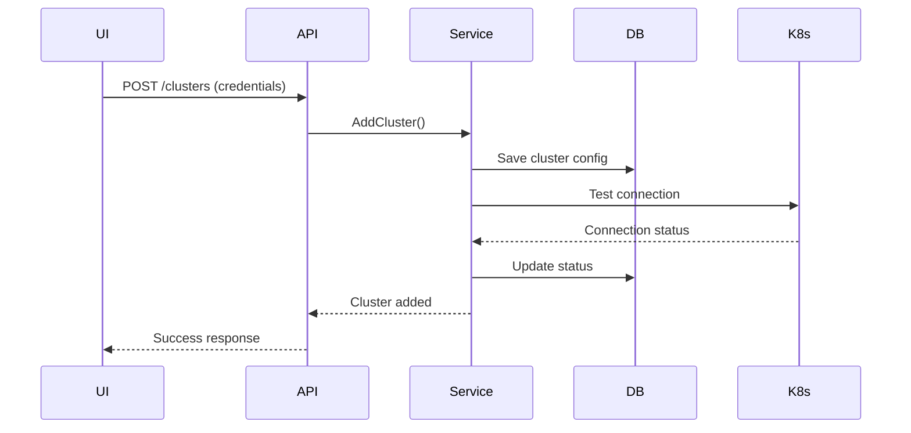
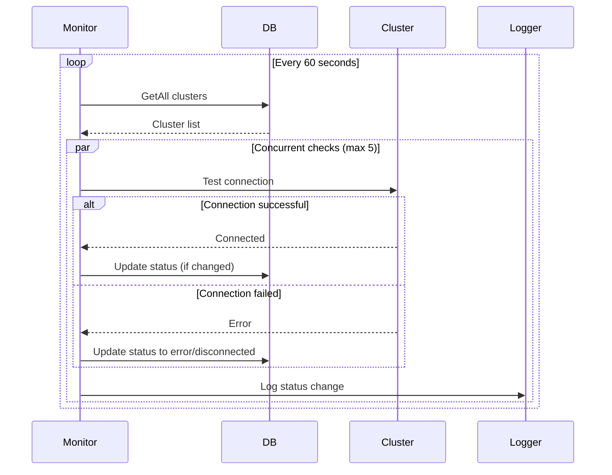

# Kubernetes Client Architecture

## Overview

KubeOrch Core implements a **MongoDB-first multi-cluster management architecture** that provides:
- **Database-driven** cluster configuration management
- **On-demand connections** created from stored credentials
- **Multi-tenancy** with user-based access control
- **CNCF-compliant** authentication patterns

## Architecture Components

### 1. Core Kubernetes Package (`/pkg/kubernetes/`)

#### Connection Helper (`connection.go`)
- **Purpose**: Creates Kubernetes clients from stored configurations
- **Features**:
  - On-demand client creation
  - Rate limiting (QPS=100, Burst=100)
  - No persistent connections

#### Configuration Loader (`config.go`)
- **Purpose**: Flexible Kubernetes configuration loading
- **Detection Order**:
  1. Explicit kubeconfig path
  2. In-cluster configuration
  3. KUBECONFIG environment variable
  4. Default ~/.kube/config location

#### Authentication (`auth.go`)
- **Supported Methods** (following CNCF patterns):
  - Service Account tokens (in-cluster)
  - Bearer tokens
  - X.509 client certificates
  - OIDC/OAuth
  - Exec providers (cloud IAM)
  - KubeConfig files
- **Security**: All auth plugins loaded for cloud provider support

### 2. Database Models (`/models/cluster.go`)

#### Cluster Model
```go
type Cluster struct {
    ID          ObjectID           // Unique identifier
    Name        string            // Internal name
    DisplayName string            // UI display name
    Server      string            // API server URL
    AuthType    ClusterAuthType   // Authentication method
    Credentials ClusterCredentials // Encrypted credentials
    Status      ClusterStatus     // Connection status
    UserID      ObjectID          // Owner
    SharedWith  []ObjectID        // Shared users
    Metadata    ClusterMetadata   // Cluster info
}
```

#### Access Control
- **User-based**: Each cluster owned by a user
- **Sharing**: Clusters can be shared with other users
- **Roles**: Admin, viewer, namespace-specific access
- **Audit**: Connection logs tracked

### 3. Services Layer

#### KubernetesClusterService (`/services/kubernetes_cluster_service.go`)
- **Purpose**: Business logic for cluster management
- **Responsibilities**:
  - Create connections on-demand from MongoDB
  - Test cluster connectivity
  - Update cluster metadata (version, nodes, namespaces)
  - Manage cluster sharing and access control
  - Log all cluster operations

### 4. Repository Layer (`/repositories/cluster_repository.go`)
- **Purpose**: Database operations for clusters
- **Responsibilities**:
  - CRUD operations for cluster configurations
  - Access control management
  - Connection audit logging
  - Default cluster management

### 5. API Handlers (`/handlers/cluster_handler.go`)

#### REST Endpoints
```
POST   /v1/api/clusters                  - Add new cluster
GET    /v1/api/clusters                  - List all clusters
GET    /v1/api/clusters/default          - Get default cluster
GET    /v1/api/clusters/:name            - Get specific cluster
DELETE /v1/api/clusters/:name            - Remove cluster
PUT    /v1/api/clusters/:name/default    - Set as default
POST   /v1/api/clusters/:name/test       - Test connection
POST   /v1/api/clusters/:name/refresh    - Refresh metadata
GET    /v1/api/clusters/:name/logs       - Get connection logs
PUT    /v1/api/clusters/:name/credentials - Update credentials
POST   /v1/api/clusters/:name/share      - Share with user
```

## Data Flow

### Adding a Cluster



### Cluster Connection Flow

1. **User adds cluster** via UI with credentials
2. **API validates** request and user permissions
3. **Service layer**:
   - Saves credentials to MongoDB
   - Creates temporary connection to test
   - Updates cluster metadata
   - Stores status in database
4. **On demand**: Connection created from MongoDB when needed
5. **No persistent connections**: Each operation creates fresh connection

## Storage Strategy

### MongoDB-Only Approach
- **Single Source of Truth**: All cluster data in MongoDB
- **No Runtime State**: Connections created on-demand
- **Encrypted Storage**: AES-256 GCM encryption for credentials
- **Consistency**: Always current data from DB

### Benefits
- **Stateless Service**: Can scale horizontally
- **No Memory Overhead**: No persistent connections
- **Always Fresh**: Latest credentials from DB
- **Simple Recovery**: Just restart service
- **Multi-Instance**: Multiple services can run simultaneously
- **Secure**: Credentials encrypted at rest

## Health Monitoring System

### Automatic Health Checks
The system includes a background health monitoring service that continuously tracks cluster connectivity:

```go
// ClusterHealthMonitor runs every 60 seconds
type ClusterHealthMonitor struct {
    interval time.Duration  // 60 seconds default
    workers  int            // 5 concurrent checks
}
```

### Health Check Flow



### Status Management
- **Smart Updates**: Only updates DB when status actually changes
- **Timestamp Tracking**: `lastCheck` field updated separately
- **Stale Detection**: Status considered stale after 2 minutes
- **Status Values**:
  - `connected`: Cluster is reachable
  - `disconnected`: Cluster unreachable
  - `error`: Authentication or configuration error
  - `unknown`: Not yet checked

## Multi-Cluster Management

### Cluster Selection
- **Default Cluster**: User's preferred cluster stored in DB
- **Per-Request**: Each API call specifies cluster
- **No State**: No "current" cluster in memory

### Access Patterns
1. **Owner Access**: Full control over cluster
2. **Shared Access**: Role-based permissions
3. **Organization Access**: Team-wide clusters (future)

## Security Considerations

### Credential Storage
- Credentials stored encrypted in MongoDB
- Never exposed in API responses
- Token refresh handled automatically

### Access Control
- User-based ownership model
- Role-based access for shared clusters
- Audit logs for all operations

### Connection Security
- TLS verification by default
- Certificate pinning support
- Insecure mode requires explicit flag

## UI Integration

### Cluster List View
```json
{
  "clusters": [
    {
      "id": "...",
      "name": "production",
      "displayName": "Production Cluster",
      "status": "connected",
      "server": "https://k8s.example.com",
      "current": true,
      "metadata": {
        "version": "v1.28.0",
        "nodeCount": 5,
        "platform": "linux"
      }
    }
  ]
}
```

### Cluster Operations
- **Add**: Form with auth method selection
- **Switch**: Dropdown for current cluster
- **Test**: Verify connectivity
- **Remove**: Delete with confirmation
- **Share**: Grant access to other users

## Benefits of This Architecture

1. **Simplicity**: No complex state management
2. **CNCF Compliance**: Follows authentication patterns from ArgoCD, Flux
3. **Multi-tenancy**: User isolation with sharing capabilities
4. **Stateless**: Service can be scaled horizontally
5. **Reliability**: No state to lose on restart
6. **Security**: Credentials always in DB, audit logging
7. **Consistency**: Single source of truth in MongoDB

## Future Enhancements

1. **Cluster Groups**: Organize clusters by environment
2. **RBAC Sync**: Import K8s RBAC to KubeOrch
3. **Metrics Collection**: Resource usage tracking
4. **Cost Management**: Cloud cost attribution
5. **GitOps Integration**: Cluster config from Git
6. **Disaster Recovery**: Cluster backup/restore